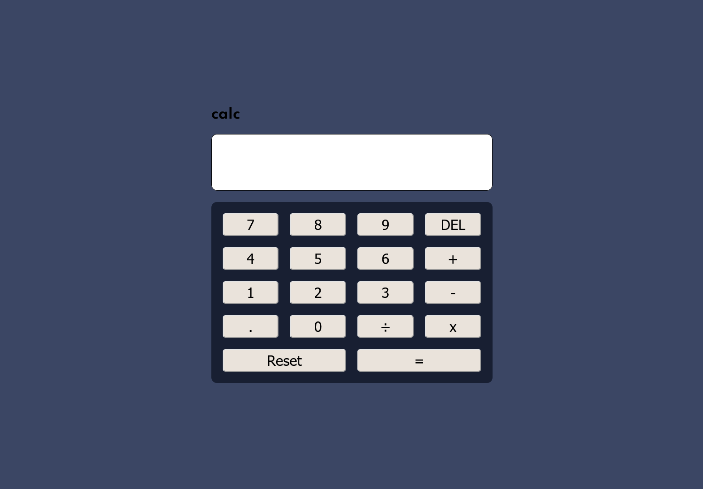

# Frontend Mentor - Calculator app solution

This is a solution to the [Calculator app challenge on Frontend Mentor](https://www.frontendmentor.io/challenges/calculator-app-9lteq5N29). Frontend Mentor challenges help you improve your coding skills by building realistic projects.

## Table of contents

- [Overview](#overview)
  - [The challenge](#the-challenge)
  - [Screenshot](#screenshot)
  - [Links](#links)
  - [Built with](#built-with)
  - [What I learned](#what-i-learned)
  - [Continued development](#continued-development)

- [Author](#author)

## Overview

Calculator app created with html, sass, scss, javascript

### The challenge

Users should be able to:

- See the size of the elements adjust based on their device's screen size
- Perform mathmatical operations like addition, subtraction, multiplication, and division
- Adjust the color theme based on their preference
- **Bonus**: Have their initial theme preference checked using `prefers-color-scheme` and have any additional changes saved in the browser

### Screenshot

### Links

- Solution URL: [https://github.com/Linn-ds/calculator-app]
- Live Site URL: [https://linn-ds.github.io/calculator-app/]

### Built with

- Semantic HTML5 markup
- Used gulp workflow to watch sass (see gulpfile.js)
- SCSS custom properties
- mixin and function (breakpoint)
- Flexbox
- CSS Grid
- Mobile-first workflow

### What I learned

I learn more about class and constractor function.Also know more about sass

### Continued development

I have to make a toggle for dark/light theme. I need to learn more...

## Author

- Facebook - [Linn Htet Aung](https://www.facebook.com/linnhtetaung.mm/)
- Twitter - [@lha_leoLupin](https://twitter.com/lha_leoLupin)

<!-- - Website - [Add your name here](https://www.your-site.com)
- Frontend Mentor - [@yourusername](https://www.frontendmentor.io/profile/yourusername)
- Twitter - [@yourusername](https://www.twitter.com/yourusername) -->
